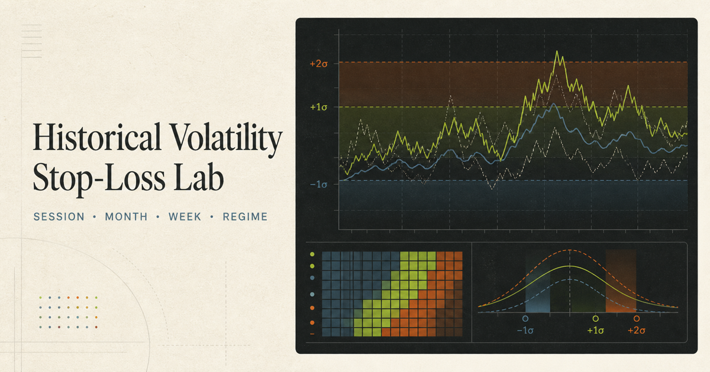

# Historical Volatility Stop-Loss Lab

An interactive, evidence-controlled dashboard for exploring how far NQ moved against a hypothetical entry over the next five or ten minutes. The history is grouped by session, calendar month, ISO week-of-year and chronological regime, then translated into MNQ risk arithmetic after the trader supplies an independent structural stop.



## What a trader can do

- Compare historical P50, P80 and P90 adverse excursion for nine trading sessions.
- Switch between five- and ten-minute horizons and pooled, long or short lenses.
- Explore month-of-year and ISO week-of-year volatility in points or ATR-normalised units.
- Check whether a structural stop sits inside or beyond historical noise bands.
- Translate the stop to whole-MNQ arithmetic using the $2-per-point multiplier and an editable round-trip cost.
- Inspect rolling regimes, NQ/MNQ overlap, execution descriptions, confidence intervals and the evidence register.

This is historical market-noise context. It does not define a strategy stop, forecast, signal or optimal position size.

## Run locally

Prerequisites: Node.js 22.13 or later.

```bash
npm ci
npm run dev
```

Open `http://localhost:3000`.

To verify both the application and the GitHub Pages build:

```bash
npm test
```

## Publish with GitHub Pages

The repository includes `.github/workflows/pages.yml`. After pushing the project to a GitHub repository:

1. Open the repository's **Settings → Pages**.
2. Under **Build and deployment**, select **GitHub Actions** as the source.
3. Push to the `main` branch, or run **Deploy dashboard to GitHub Pages** manually from the Actions tab.

The workflow installs the locked dependencies, creates the static site in `github-pages/`, uploads it and deploys it. Relative asset paths allow the dashboard to run from either a user site or a project repository path.

## Data lineage and regeneration

The committed browser dataset is `public/data/dashboard-data.json`. It was built from the controlled output folder `../nq_long_history_outputs` and verified against `generated_output_manifest.json` before export.

To regenerate it on a machine that has those controlled outputs:

```bash
npm run data
```

The exporter is `scripts/build_dashboard_data.py`. It selects the required rows, compacts the fields and records the analysis-manifest and raw-DBN hashes inside the browser dataset. The GitHub deployment uses the committed JSON so the large private/raw source files are never uploaded.

## Project structure

- `components/VolatilityDashboard.tsx` — shared interactive interface.
- `app/` — vinext/Sites application entry.
- `github/` and `vite.github.config.ts` — static GitHub Pages entry and build.
- `public/data/` — controlled browser data extract.
- `scripts/` — reproducible extract builder.
- `tests/` — application, static-build and headline-finding checks.
- `docs/TRADER_GUIDE.md` — plain-language findings and interpretation.
- `.github/workflows/pages.yml` — GitHub Pages deployment.

## Evidence controls

- Raw NQ DBN records: 6,486,332.
- Coverage: 2010-06-06 through 2026-08-11.
- Trading-day grouping timezone: America/New_York.
- Bootstrap: 10,000 whole-day clustered replications, fixed seed 20260811.
- Degraded session-days are excluded from the relevant calculations.
- The dashboard shows sample days and warnings before interpretation.

## Licence

The application code is provided under the MIT licence. Historical data and third-party source files are not relicensed or included.
